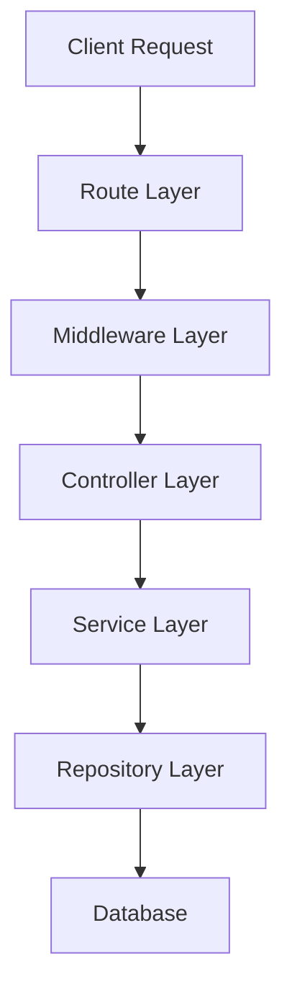
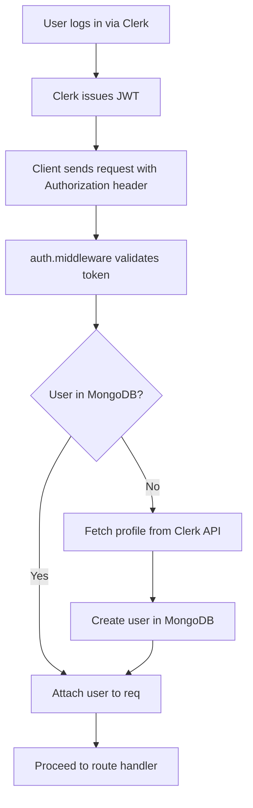
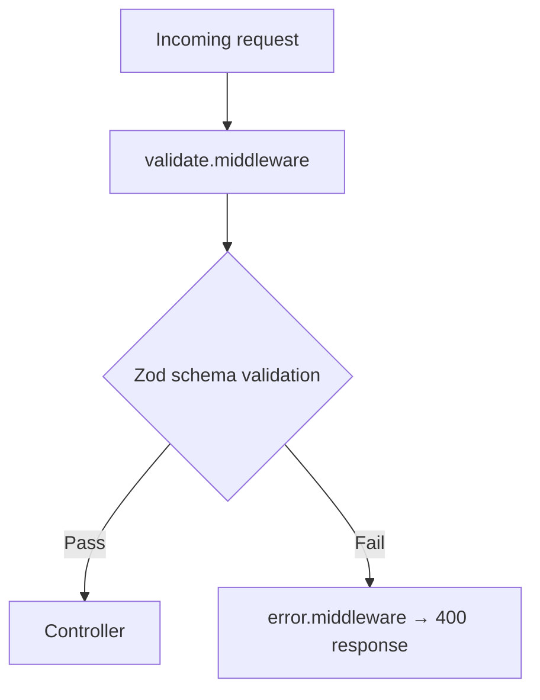

# Backend Architecture

## Table of Contents
- [Overview](#overview)
- [Feature-Based Structure](#feature-based-structure)
- [Request Lifecycle](#request-lifecycle)
- [Layer Responsibilities](#layer-responsibilities)
  - [Routes](#routes)
  - [Middleware](#middleware)
  - [Controllers](#controllers)
  - [Services](#services)
  - [Repositories](#repositories)
- [Authentication Flow](#authentication-flow)
- [Validation Flow](#validation-flow)
- [Adding a New Feature](#adding-a-new-feature)

## Overview

The backend follows a **feature‑based architecture**. Instead of grouping files by technical responsibility (MVC style), code is organized around application features. Each feature contains everything required for that domain.

## Feature‑Based Structure

```
src/
├─ app.js                # Express app and global middleware
├─ config/
│   └─ db.js             # MongoDB connection
├─ features/
│   └─ users/
│       ├─ user.model.js         # Mongoose model
│       ├─ user.repository.js    # Data access layer
│       ├─ user.service.js       # Business logic
│       ├─ user.controller.js    # HTTP handlers
│       ├─ user.routes.js        # Express router
│       └─ user.validation.js    # Zod schemas
├─ middleware/
│   ├─ auth.middleware.js      # Clerk authentication
│   ├─ validate.middleware.js  # Zod validation
│   └─ error.middleware.js     # Global error handling
└─ server.js              # Server entry point
```

### Why Feature‑Based?

- Keeps related code together, improving ownership.
- Easier to add new domains (e.g., tournaments, matches) without touching unrelated files.
- Reduces coupling and navigation overhead.

## Request Lifecycle

A request follows this flow:



## Layer Responsibilities

### Routes
- Location: `features/*/user.routes.js`
- Define API endpoints, attach middleware, connect controllers.
- **Should not** contain DB queries or business logic.

```js
// Example route
router.get('/me', userAuth, me);
```

---
### Middleware
- Location: `src/middleware/`
- Handles authentication, validation, and error handling.
- **Current middleware**:
  - `auth.middleware` – extracts Clerk user ID (includes `userAuth` and `adminAuth`).
  - `validate.middleware` – validates request bodies with Zod.
  - `error.middleware` – formats errors into consistent responses.

---
### Controllers
- Receive request data, call services, and send responses.
- Keep logic thin; delegate to services.

---
### Services
- Contain business rules and orchestrate multiple repositories when needed.
- Example: checking if a user exists before returning profile data.

---
### Repositories
- Directly interact with MongoDB via Mongoose.
- Provide simple CRUD functions (`findById`, `create`, `update`, `delete`).

---
## Authentication Flow



## Validation Flow



## Adding a New Feature

To add a new domain (e.g., tournaments):
1. Create a folder under `features/` (e.g., `features/tournaments/`).
2. Add the typical files:
   - `tournament.model.js`
   - `tournament.repository.js`
   - `tournament.service.js`
   - `tournament.controller.js`
   - `tournament.routes.js`
   - `tournament.validation.js`
3. Register the router in `src/app.js`.

---
