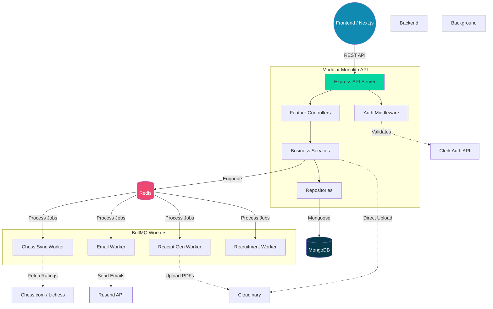
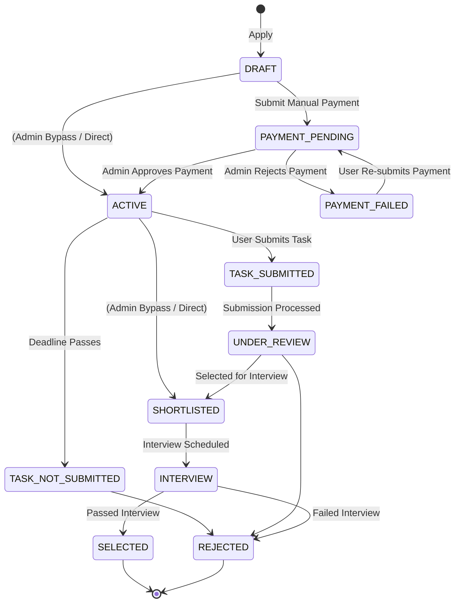
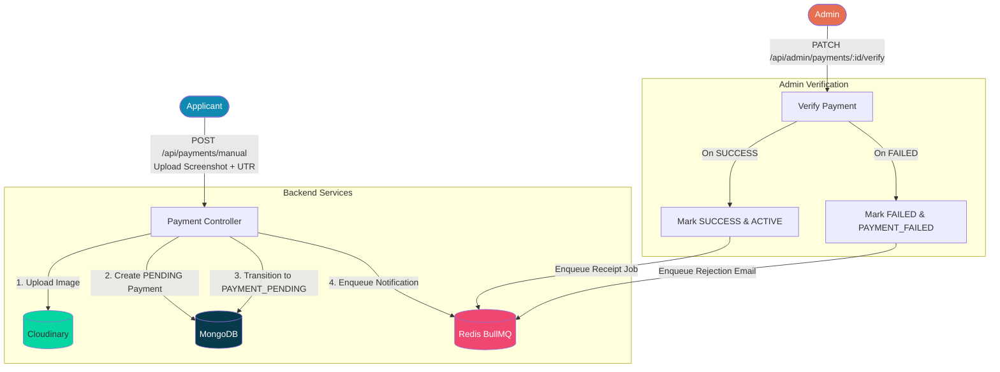
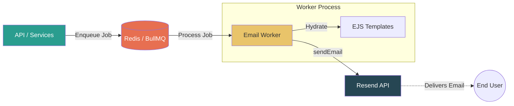

# Backend Architecture

## Table of Contents

- [Overview](#overview)
- [Feature-Based Structure](#feature-based-structure)
- [Request Lifecycle](#request-lifecycle)
- [Layer Responsibilities](#layer-responsibilities)
  - [Routes](#routes)
  - [Middleware](#middleware)
  - [Controllers](#controllers)
  - [Services](#services)
  - [Repositories](#repositories)
- [Authentication Flow](#authentication-flow)
- [Validation Flow](#validation-flow)
- [Background Sync Flow (Chess Accounts)](#background-sync-flow-chess-accounts)
- [Leaderboard Flow](#leaderboard-flow)
- [Recruitment Service Flow](#recruitment-service-flow)
- [Manual Payment & Receipt Flow](#manual-payment--receipt-flow)
- [Email Notification Flow](#email-notification-flow)
- [Events Management Flow](#events-management-flow)
- [Task Service Flow](#task-service-flow)
- [Submission Service Flow](#submission-service-flow)
- [Admin System Services](#admin-system-services)
- [Adding a New Feature](#adding-a-new-feature)

## Overview

The backend follows a **feature‑based architecture**. Instead of grouping files by technical responsibility (MVC style), code is organized around application features. Each feature contains everything required for that domain.

## Overall System Architecture

The application follows a modular monolith architecture where features are isolated as independent domains with clear boundaries, allowing future extraction into services if needed.



```mermaid
flowchart TD
    Client((Frontend / Next.js)) -->|REST API| Express[Express API Server]
    
    subgraph Backend Core [Modular Monolith API]
        Express --> Auth[Auth Middleware]
        Express --> Controllers[Feature Controllers]
        Controllers --> Services[Business Services]
        Services --> Repos[Repositories]
    end
    
    Auth -.->|Validates| Clerk[Clerk Auth API]
    Repos -->|Mongoose| MongoDB[(MongoDB)]
    
    subgraph Background Workers [BullMQ Workers]
        SyncWorker[Chess Sync Worker]
        EmailWorker[Email Worker]
        ReceiptWorker[Receipt Gen Worker]
        RecruitmentWorker[Recruitment Worker]
    end
    
    Services -->|Enqueue| Redis[(Redis)]
    Redis -->|Process Jobs| SyncWorker
    Redis -->|Process Jobs| EmailWorker
    Redis -->|Process Jobs| ReceiptWorker
    Redis -->|Process Jobs| RecruitmentWorker
    
    SyncWorker -.->|Fetch Ratings| ChessAPI[Chess.com / Lichess]
    EmailWorker -.->|Send Emails| Resend[Resend API]
    ReceiptWorker -.->|Upload PDFs| Cloudinary[Cloudinary]
    Services -.->|Direct Upload| Cloudinary

    style Client fill:#118ab2,color:#fff
    style Express fill:#06d6a0,color:#333
    style MongoDB fill:#073b4c,color:#fff
    style Redis fill:#ef476f,color:#fff
    style Backend Core fill:#f8f9fa,stroke:#ccc
    style Background Workers fill:#f8f9fa,stroke:#ccc
```

## Feature‑Based Structure

```
src/
├─ app.js                # Express app and global middleware
├─ server.js             # Server entry point, initialises workers & schedulers
├─ config/
│   └─ db.js             # MongoDB connection
├─ redis/
│   └─ redis.client.js   # IORedis client (used by BullMQ)
├─ features/
│   ├─ admin/
│   │   ├─ admin.controller.js
│   │   ├─ admin.routes.js
│   │   ├─ admin.service.js
│   │   └─ admin.validation.js
│   ├─ contact/
│   │   ├─ contact.controller.js
│   │   ├─ contact.model.js
│   │   └─ contact.routes.js
│   ├─ email/
│   │   ├─ email.service.js
│   │   ├─ email.queue.js
│   │   ├─ email.worker.js
│   │   └─ templates/
│   ├─ events/
│   │   ├─ event.controller.js
│   │   ├─ event.model.js
│   │   ├─ event.repository.js
│   │   ├─ event.routes.js
│   │   └─ event.service.js
│   ├─ leaderboard/
│   │   ├─ leaderboard.controller.js
│   │   ├─ leaderboard.routes.js
│   │   └─ leaderboard.service.js
│   ├─ logs/
│   │   └─ log.model.js
│   ├─ payments/
│   │   ├─ payment.controller.js          # manual submission, admin verification
│   │   ├─ payment.model.js               # manual payment ledger schema
│   │   ├─ payment.repository.js
│   │   ├─ payment.routes.js
│   │   ├─ receipt.queue.js               # Queue for receipt generation
│   │   ├─ receipt.worker.js              # PDF generation worker (Puppeteer)
│   │   └─ templates/
│   ├─ recruitment/
│   │   ├─ recruitment.constants.js       # Enums + VALID_TRANSITIONS state machine
│   │   ├─ recruitment.controller.js      # createApplication, getMyApplication
│   │   ├─ recruitment.model.js           # Mongoose Recruitment schema
│   │   ├─ recruitment.queue.js           # BullMQ queue definition
│   │   ├─ recruitment.repository.js      # Data access layer
│   │   ├─ recruitment.routes.js          # Express router
│   │   ├─ recruitment.scheduler.js       # Cron: daily expiry dispatcher
│   │   ├─ recruitment.service.js         # Business logic + state transitions
│   │   ├─ recruitment.validation.js      # Zod validation schemas
│   │   └─ recruitment.worker.js          # BullMQ worker: autoRejectExpiredApplications
│   ├─ settings/
│   │   ├─ settings.controller.js
│   │   ├─ settings.model.js
│   │   └─ settings.routes.js
│   ├─ storage/
│   │   ├─ providers/
│   │   │   └─ cloudinary.provider.js     # Cloudinary SDK init
│   │   └─ storage.service.js             # uploadFile, deleteFile, generateSignedUrl
│   ├─ submissions/
│   │   ├─ submission.controller.js       # uploadTaskSubmission, getTaskSubmission
│   │   ├─ submission.model.js            # Mongoose Submission schema
│   │   ├─ submission.repository.js       # Data access layer
│   │   └─ submission.routes.js           # Express router
│   ├─ sync/
│   │   ├─ adapters/                      # Chess.com + Lichess adapters
│   │   ├─ sync.engine.js                 # Core sync + leaderboard update logic
│   │   ├─ sync.queue.js
│   │   ├─ sync.scheduler.js              # Cron: daily sync dispatcher
│   │   └─ sync.worker.js
│   ├─ tasks/
│   │   ├─ task.controller.js
│   │   ├─ task.model.js                  # Department + Task schemas
│   │   ├─ task.repository.js
│   │   ├─ task.routes.js
│   │   └─ task.service.js
│   ├─ users/
│   │   ├─ user.model.js
│   │   ├─ user.repository.js
│   │   ├─ user.service.js
│   │   ├─ user.controller.js
│   │   ├─ user.routes.js
│   │   └─ user.validation.js
│   └─ webhooks/
│       ├─ webhook.controller.js          # external service webhooks (e.g. Clerk)
│       └─ webhook.routes.js
├─ middleware/
│   ├─ auth.middleware.js      # Clerk JWT authentication (userAuth, adminAuth)
│   ├─ upload.middleware.js    # Multer memory storage (10 MB limit)
│   ├─ validate.middleware.js  # Zod schema validation
│   └─ error.middleware.js     # Global error formatting
└─ server.js                   # Entry: starts Express + workers + schedulers
```

### Why Feature‑Based?

- Keeps related code together, improving ownership.
- Easier to add new domains (e.g., tournaments, matches) without touching unrelated files.
- Reduces coupling and navigation overhead.

## Request Lifecycle

A request follows this flow:


## Layer Responsibilities

### Routes

- Location: `features/*/user.routes.js`
- Define API endpoints, attach middleware, connect controllers.
- **Should not** contain DB queries or business logic.

```js
// Example route
router.get("/me", userAuth, me);
```

---

### Middleware

- Location: `src/middleware/`
- Handles authentication, validation, and error handling.
- **Current middleware**:
  - `auth.middleware` – extracts Clerk user ID (includes `userAuth` and `adminAuth`).
  - `validate.middleware` – validates request bodies with Zod.
  - `error.middleware` – formats errors into consistent responses.

---

### Controllers

- Receive request data, call services, and send responses.
- Keep logic thin; delegate to services.

---

### Services

- Contain business rules and orchestrate multiple repositories when needed.
- Example: checking if a user exists before returning profile data.

---

### Repositories

- Directly interact with MongoDB via Mongoose.
- Provide simple CRUD functions (`findById`, `create`, `update`, `delete`).

---

## Authentication Flow


## Validation Flow


## Background Sync Flow (Chess Accounts)

To keep API responses fast, external API synchronization is decoupled using a queue-based system.


- **Adapters**: Isolated files (`chesscom.adapter.js`, `lichess.adapter.js`) strictly handle fetching and normalizing data from external platforms.
- **Engine**: Coordinates the sync logic and executes a single database update at the end to minimize writes.
- **Queue**: Uses BullMQ + Redis to manage job states, retries, and errors without blocking the user's request lifecycle.

## Leaderboard Flow

The leaderboard relies on Redis Sorted Sets (`ZADD`, `ZREVRANGE`, `ZREVRANK`) to provide fast ranking data without heavy MongoDB aggregation queries.


- **Update**: Triggered automatically by the `SyncEngine` whenever a user's ratings change.
- **Get Leaderboard**: Pulls the top IDs and their scores from Redis, then hydrates the response by querying MongoDB for those specific User documents.
- **Get My Rank**: Directly queries Redis for the authenticated user's exact rank (0-indexed, shifted to 1-indexed) without hitting MongoDB.

## Recruitment Service Flow

The recruitment pipeline enforces a strict finite state machine.



```mermaid
stateDiagram-v2
    [*] --> DRAFT : Apply
    
    DRAFT --> PAYMENT_PENDING : Submit Manual Payment
    DRAFT --> ACTIVE : (Admin Bypass / Direct)
    
    PAYMENT_PENDING --> ACTIVE : Admin Approves Payment
    PAYMENT_PENDING --> PAYMENT_FAILED : Admin Rejects Payment
    PAYMENT_FAILED --> PAYMENT_PENDING : User Re-submits Payment
    
    ACTIVE --> TASK_SUBMITTED : User Submits Task
    ACTIVE --> TASK_NOT_SUBMITTED : Deadline Passes
    ACTIVE --> SHORTLISTED : (Admin Bypass / Direct)
    
    TASK_SUBMITTED --> UNDER_REVIEW : Submission Processed
    
    TASK_NOT_SUBMITTED --> REJECTED
    
    UNDER_REVIEW --> SHORTLISTED : Selected for Interview
    UNDER_REVIEW --> REJECTED
    
    SHORTLISTED --> INTERVIEW : Interview Scheduled
    
    INTERVIEW --> SELECTED : Passed Interview
    INTERVIEW --> REJECTED : Failed Interview
    
    SELECTED --> [*]
    REJECTED --> [*]
```

- **Apply**: `POST /api/recruitment/apply` — Creates a `DRAFT` application.
- **State Transitions**: All status changes go through `transitionStatus()` in `recruitment.service.js`, which validates against `VALID_TRANSITIONS` before writing.
- **Background Expiry**: A daily cron (via BullMQ + Redis) fires `autoRejectExpiredApplications()` at midnight, deleting any `PAYMENT_PENDING` applications older than 24 hours.

## Manual Payment & Receipt Flow

The application has switched to a fully manual payment verification process, removing the legacy Razorpay gateway.


```mermaid
flowchart TD
    User([Applicant]) -->|POST /api/payments/manual\nUpload Screenshot + UTR| API[Payment Controller]
    
    subgraph Backend Services
        API -->|1. Upload Image| Cloudinary[(Cloudinary)]
        API -->|2. Create PENDING Payment| DB[(MongoDB)]
        API -->|3. Transition to PAYMENT_PENDING| DB
        API -->|4. Enqueue Notification| Queue[(Redis BullMQ)]
    end
    
    Admin([Admin]) -->|PATCH /api/admin/payments/:id/verify| Verify[Verify Payment]
    
    subgraph Admin Verification
        Verify -->|On SUCCESS| SuccessFlow[Mark SUCCESS & ACTIVE]
        Verify -->|On FAILED| FailedFlow[Mark FAILED & PAYMENT_FAILED]
    end
    
    SuccessFlow -->|Enqueue Receipt Job| Queue
    FailedFlow -->|Enqueue Rejection Email| Queue

    style User fill:#118ab2,color:#fff
    style Admin fill:#e76f51,color:#fff
    style DB fill:#073b4c,color:#fff
    style Queue fill:#ef476f,color:#fff
    style Cloudinary fill:#06d6a0,color:#333
```

1. **Submission**: `POST /api/payments/manual` - The applicant uploads a screenshot of their transaction along with the UTR number. The screenshot is uploaded to Cloudinary, a `PENDING` record is created in the `Payments` collection, and the application transitions to `PAYMENT_PENDING`. An email is queued notifying them that their payment is under review.
2. **Verification**: `PATCH /api/admin/payments/:id/verify` - An admin reviews the screenshot and UTR. 
   - **On Success**: A MongoDB Transaction is used to update the `Payment` ledger to `SUCCESS` and transition the application to `ACTIVE`. A background job is enqueued to generate a receipt.
   - **On Failure**: The ledger is marked `FAILED` with a rejection reason, the application transitions to `PAYMENT_FAILED`, and an email is queued to notify the candidate.
3. **Receipt Generation**: The `receipt-queue` (BullMQ worker) uses Puppeteer to render a PDF receipt from an EJS template, uploads/stores it, and triggers a success email with the receipt attached.

## Email Notification Flow

Email notifications are offloaded to a background worker to ensure fast API responses and decoupled logic.


```mermaid
flowchart LR
    API[API / Services] -->|Enqueue Job| Queue[(Redis / BullMQ)]
    Queue -->|Process Job| Worker[Email Worker]
    
    subgraph Worker Process
        Worker -->|Hydrate| EJS[EJS Templates]
    end
    
    Worker -->|sendEmail| Resend[Resend API]
    Resend -.->|Delivers Email| User((End User))

    style API fill:#2a9d8f,color:#fff
    style Queue fill:#e76f51,color:#fff
    style Worker fill:#e9c46a,color:#333
    style Resend fill:#264653,color:#fff
```

- **Queue**: Uses BullMQ (`email-queue`) backed by Redis.
- **Worker**: The background worker picks up jobs, hydrates EJS templates located in `src/features/email/templates/` with user data, and dispatches them.
- **Provider**: Uses **Resend** (via `resend` SDK) for reliable email delivery.
- **Use Cases / Job Types**:
  - `send-welcome-email`: Sent when a user registers/onboards.
  - `send-payment-pending-email`: Sent when a user submits a manual payment.
  - `send-payment-success-email`: Sent by admin upon verification (includes receipt URL).
  - `send-payment-failed-email`: Sent by admin upon rejection (includes reason).
  - `send-contact-us-email`: Forwards contact form submissions to the club's email.
  - `send-draft-reminder-email`: Reminds users with pending applications.

## Events Management Flow

The `events` feature allows the club to host, display, and manage chess tournaments or offline events.
- **Models**: Defines an `Event` with capacities, deadlines, and a `status` (upcoming, ongoing, completed, cancelled).
- **Admin**: Admins create and modify events.
- **Public**: End-users can query the list of active events to participate or view details.

## Task Service Flow

Tasks are seeded per recruitment year and department. Each task has a `submission` sub-schema that controls what types of responses are accepted:

- `acceptsText` — free-form text answer
- `acceptsLinks` — external URLs (e.g., GitHub repo link)
- `acceptsFiles` — file uploads, governed by `fileCategory`, `maxFiles`, and `maxFileSize`


Endpoints:

- `GET /api/tasks/department?departmentId=&year=` — Tasks for a specific department
- `GET /api/tasks/?year=` — All tasks for a year

## Submission Service Flow


On upload:

1. Validates the caller's application is `ACTIVE` (cross-service check).
2. Fetches the task's `submission` rules (cross-service check).
3. Validates all files against those rules (count, size, MIME type).
4. Streams each file buffer to **Cloudinary** via `upload_stream` into `recruitment/{year}/{DEPT_CODE}/{applicationId}/`.
5. Upserts the `Submission` document in MongoDB (unique index: `applicationId + taskId`).

On fetch (`GET /api/submissions/:appId/:taskId`):

- Generates a **signed Cloudinary URL** (15-minute TTL) per stored file so admins and the applicant can securely view uploaded assets.

## Admin System Services

The admin module is highly privileged and handles beyond simple CRUD:
- **`POST /api/admin/redis/clean`**: Clears out stale leaderboard sorted sets.
- **`POST /api/admin/cloud/clean`**: Purges unused or orphaned assets from Cloudinary.
- **`POST /api/admin/users/sync-all`**: Dispatches a global queue job to re-sync all chess ratings from external APIs.
- **`POST /api/admin/applications/remind-drafts`**: Enqueues reminder emails for users sitting on `DRAFT` applications.

## Adding a New Feature

To add a new domain (e.g., tournaments):

1. Create a folder under `features/` (e.g., `features/tournaments/`).
2. Add the typical files:
   - `tournament.model.js`
   - `tournament.repository.js`
   - `tournament.service.js`
   - `tournament.controller.js`
   - `tournament.routes.js`
   - `tournament.validation.js`
3. Register the router in `src/app.js`.
