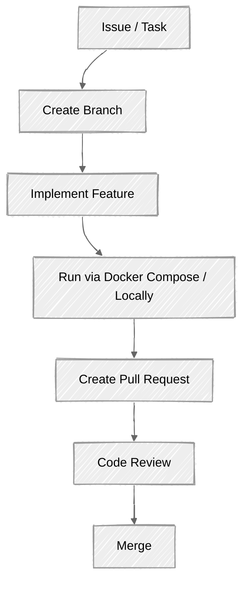

# Contribution Guide

Welcome to the En-Passant backend project.

This document explains how developers should contribute code, add features, and maintain project quality.

---

# Before Starting Development

Before writing code:

1. Read the project README
2. Read the architecture documentation
3. Understand the existing feature structure
4. Check existing issues and tasks

## Required Reading

- `README.md`
- `docs/ARCHITECTURE.md`
- `docs/API.md`
- `docs/DEVELOPMENT_GUIDE.md`

---

# Development Workflow

The standard development flow:



## Running Locally

We recommend using Docker to spin up Redis for your local BullMQ queues:

```bash
docker-compose up -d redis
npm run dev
```

Alternatively, you can run the entire backend via Docker:

```bash
docker-compose up --build
```

---

# Pull Request Guidelines

Every pull request should contain:

## Description

Explain:

- What was changed
- Why it was changed

Example:

> Added user profile update API.
>
> Allows members to update:
>
> - branch
> - year
> - chess accounts

## Coding Standards Checklist

Before submitting, ensure your code adheres to our project standards:

- [ ] **Validation**: All incoming requests are validated using `zod` schemas in the route middleware.
- [ ] **Error Handling**: Use the central `AppError` class from `src/utils/AppError.js` to throw operational errors (e.g. `throw new AppError("Message", 400);`). Do not use raw `res.status().json()` for errors.
- [ ] **Feature Isolation**: Ensure your feature logic is contained within `src/features/[feature_name]/`.

---

## Testing

Mention:

- APIs tested
- Edge cases checked
- Manual testing performed

---

## Documentation

If your changes affect:

- APIs
- Database schema
- Architecture
- Development workflow

Update the related documentation before creating a pull request.
